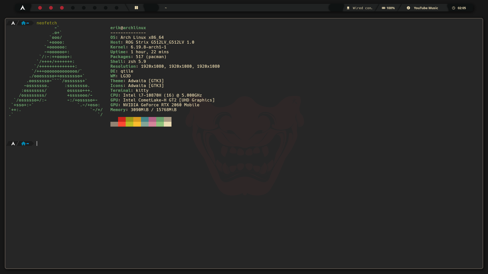

# 🏠 Dotfiles

My personal **Arch Linux** configuration files, managed with [GNU Stow](https://www.gnu.org/software/stow/) for a modular and reproducible development environment.



[](https://archlinux.org/)
[](https://qtile.org/)
[](https://neovim.io/)
[](https://www.reddit.com/r/unixporn/)

---

## 🛠️ System Components

| Role | Tool |
| --- | --- |
| **Window Manager** | [Qtile](https://qtile.org/) |
| **Terminal Emulator** | [Kitty](https://sw.kovidgoyal.net/kitty/) |
| **Shell** | Zsh — Oh My Zsh + Powerlevel10k |
| **Text Editor** | [Neovim](https://neovim.io/) *(NvChad distribution)* |
| **Application Launcher** | [Rofi](https://github.com/davatorium/rofi) |
| **Compositor** | [Picom](https://github.com/yshui/picom) *(animations & blur)* |
| **Theme** | Gruvbox |

---

## 📂 Repository Structure

Each top-level directory is a **GNU Stow package** that symlinks its contents into `$HOME`:

```
dotfiles/
├── kitty/          # Terminal emulator themes and performance settings
├── nvim/           # Neovim setup via NvChad framework
├── picom/          # Compositor rules: transparency, shadows and blur
├── qtile/          # WM config, assets, wallpapers and monitor scripts
├── rofi/           # Launcher menus and WiFi management scripts
├── x11/            # X server init and startup logic (.xinitrc)
├── zsh/            # Shell config files (.zshrc, .p10k.zsh)
├── aur_pkglist.txt # AUR packages (managed via paru)
├── pkglist.txt     # Official Arch repository packages
├── install.sh      # Bootstrap installation script
└── sync.sh         # Sync helper script
```

---

## 📦 Package Management

This setup uses a **dual-list system** to track all installed software:

* `pkglist.txt` — Official Arch Linux repository packages.
* `aur_pkglist.txt` — Community (AUR) packages, managed via [`paru`](https://github.com/Morganamilo/paru).

Both lists are kept up to date automatically by the `dotsync` workflow (see below).

---

## 🚀 Installation

> **Prerequisites:** only `git` is required. Everything else (`stow`, `paru`, Oh My Zsh, Powerlevel10k) is handled automatically by the script.

**1. Clone the repository:**

```bash
git clone https://github.com/Erik2K/dotfiles.git ~/dotfiles
cd ~/dotfiles
```

**2. Run the installation script:**

```bash
chmod +x install.sh
./install.sh
```

The script takes care of the full setup in order:

1. **Base tools** — installs `base-devel`, `git` and `stow` via `pacman`.
2. **Oh My Zsh** — installs the framework if not already present.
3. **Powerlevel10k** — clones the theme into the Oh My Zsh custom themes directory.
4. **Paru** — builds and installs the AUR helper from source if not found.
5. **Packages** — installs everything from `pkglist.txt` (pacman) and `aur_pkglist.txt` (paru).
6. **Symlinks** — deploys all config packages with `stow`:

```
qtile  nvim  kitty  rofi  picom  gtk  zsh  x11
```

---

## 🔄 Maintenance Workflow

A `dotsync` alias defined in `.zshrc` keeps the local system and the remote repository in sync:

```bash
alias dotsync='~/dotfiles/sync.sh'
```

When executed, it automatically:

1. Regenerates `pkglist.txt` and `aur_pkglist.txt` from currently installed packages.
2. Commits all configuration changes inside `~/dotfiles`.
3. Pushes the latest updates to this GitHub repository.

---

## 🙏 Credits

The Qtile status bar is based on [Cozytile](https://github.com/Darkkal44/Cozytile) by Darkkal44, adapted to fit this setup.
